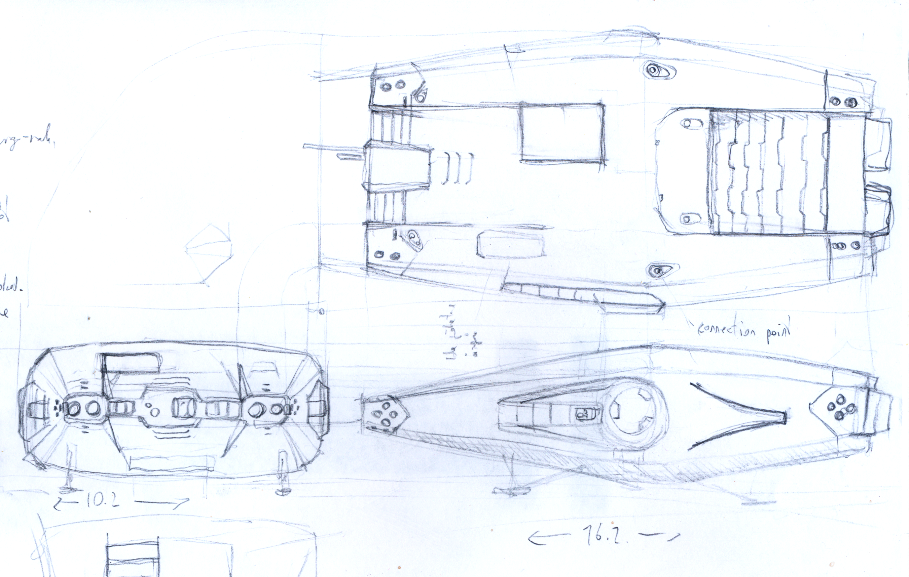

# Sketching and ideation

Based on our gathered reference we start to sketch out the asset. This can be a rough drawing or a very simply put together 3d model, or even a combination of both.

The aim is to figure out the character of the asset, its main shape language and proportions.

Don't worry if you aren't much of a drawer/painter, crude 3D sketches are good too! But don't overcomplicate them in this stage.

But if you happen to be an artist who can handle the pencil or painting software, contributions of "only" concept artworks would be much appreciated.

## Block-out

From our sketch we start to build out a very rough model of the ship. We figure out exact proportions, and the shape language starts to solidify as well, even if it is still a crude model.

Booleans, and parts intersecting each other are legitimate tools in this phase. Not to mention grabbing parts from our (wip) parts library or other ships.

No need to worry too much about model quality, since we will clean it up in the next phase, or even remodel it from scratch based on the block-out.

And the nice thing is that one can easily draw over block-outs to figure out details:

The block-out phase is also where one should start gauging the capacities of the ship, to make sure that makes sense for the description. The volume measurement tool of the 3D printing addon is very useful for this.

And one might even be able to test the block-out in-game, if it is set up. Likely it will look ugly, and will have issues though, but can be quite motivating. This kind of testing can be done practically anywhere down the line. See the model system description on how to set it up.