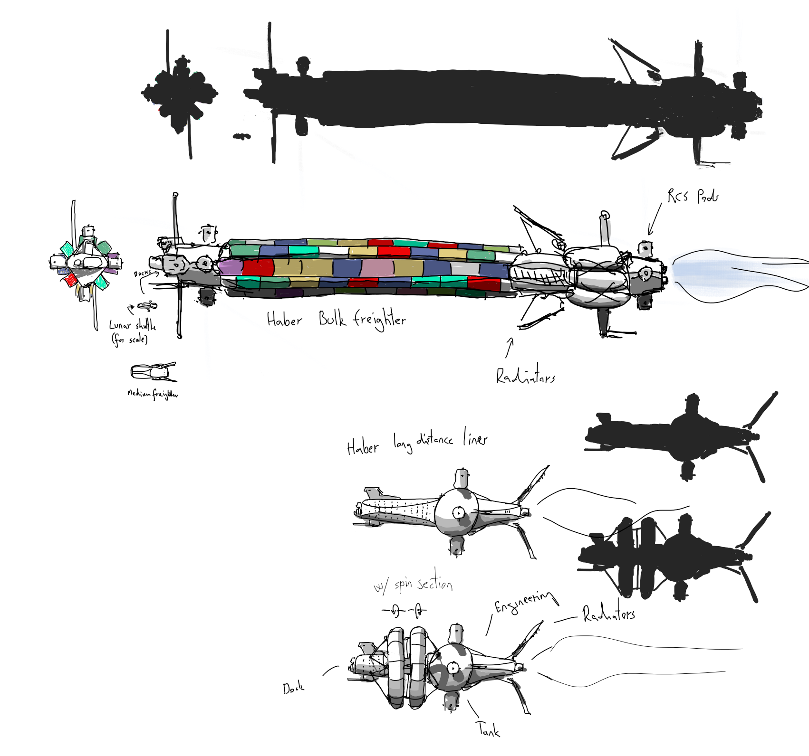

# 3D asset workflow

This article provides an overview of the preferred 3D asset workflow, with detailed descriptions where applicable. If you want your model to be included in Pioneer, then following these steps, and discussing it with the others in the team is very important (and watching an asset mature is always a treat). You should also read through the <u>style guide</u> (TODO), so all assets can be on a common consistent ground.

> TODO: Create a flowchart

## TL;DR

> A quick writeup of the main steps and key information (should be collapsible)

- mesh requirements and tri counts
- Model system
- formats (dae, dds)

### Tools

These are the tools we are currently using. Other software could be used as well if it can output the desired formats, but we might only be able to provide limited help with those depending on experience with the given software. 

As of now all contributors are working in **[Blender](https://www.blender.org/)**. There were ships made in 3D Studio Max in the past.

Decals are created with the **[DecalMachine](https://blendermarket.com/products/decalmachine)** addon, and then their AO, normals and masks are baked to textures. In the future we hope to support decals in-game.

Texturing is either done with **Blender** with a special material setup (to link!), or with **[Substance Painter](https://store.steampowered.com/app/1775390/Substance_3D_Painter_2022/)**. Texture finetuning, compositing and touchups are mostly done in **[Krita](https://krita.org/)**.

### Planned assets

We have a (todo) list of planned/wanted ships, stations and buildings (or reworks of them). Feel free to pick one that's in the TODO column, and bring it up on IRC.

### The feedback cycle

It is very important that while you are working your way through any asset, to discuss it and get feedback. The others in the team can provide a lot of information and constructive critique. This can also help to avoid unnecessary work and rework when for example the ship in question is very different from our intended style (think Enterprise in the Expanse), or if a certain part of the ship would not work nicely with an upcoming feature.

## [Concept phase](./3d_wf_concept.md)

This is where we come up with the concept, the idea for the given asset, be it a ship, a building or a space station or anything else. We pick the manufacturer, the role and the size of the ship, and preferably write a short description. This is also when we gather up the reference material for inspiration.

The importance of this phase lies in that this kind of sketch iteration can be done fast and easy, so the character of the asset, and all issues can be hammered out relatively simply, and the concept can mature before committing to the busywork of modeling.

## [Modeling phase](./3d_wf_modeling.md)

This is the fun part, when you start to clean up and properly model the blocked out asset. 

## [Animation](./3d_wf_animation.md)

## [Texturing phase](./3d_wf_texturing.md)

## [Setup phase](./3d_wf_setup.md)

## [Submitting](./3d_wf_submit.md)

